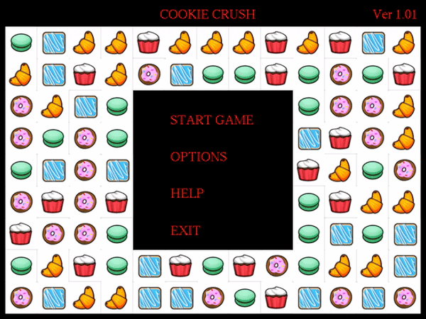

# Cookie Crush

Cookie crush is a 2D game built in C++ using GLUT (OpenGL Utility Toolkit).

<table>
  <tr>
    <td></td>
    <td></td>
  </tr>
</table>

## Gameplay

The game is played using the mouse. Cookies of different shapes fill the board and can be swapped only to consective tiles i.e top, bottom, right or left. Swapping is only allowed if after swapping we have a combination of three or more than three cookies of same shape. Whenever the cookies get crushed, the cookies are dropped from top to the empty slots. The game is played for only 2 mins.

## Environment

* IDE - Visual Studio 2019
* Platform Toolset - v142
* Windows SDK Version - 10.0
* C++ Language Standard - ISO C++14 Standard
